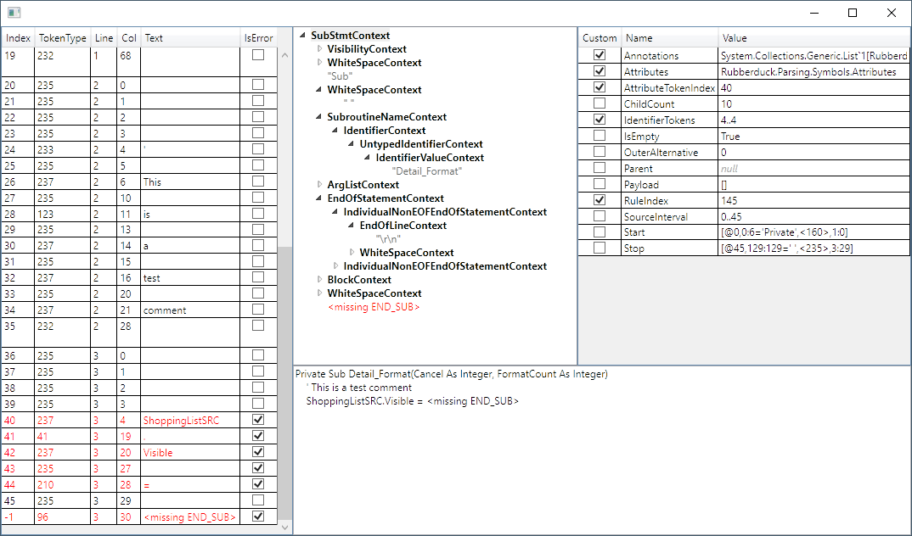

# ANTLR4 Parse Tree Visualizer

  

This project is very much in an alpha stage. It currently only targets `RuleContext` and derived classes.

## Installation

Download the compiled DLL from the [releases](https://github.com/zspitz/ANTLR4ParseTreeVisualizer/releases) page, and unblock (right-click from Explorer, select **Properties** and check the **Unblock** checkbox). Alternatively, you can compile the source  yourself.

Make sure the compiled DLL matches your version of Visual Studio -- 2019 or 2017.

Save the compiled DLL in one of Visual Studio's recognized visualizer folders. You don't have to restart VS, just make sure VS is not currently in a debugging session:

* _VisualStudioInstallPath_`\Common7\Packages\Debugger\Visualizers`
* `My Documents\Visual Studio `_Version_`\Visualizers`

## Usage

1. Begin a debugging session, and break at some point.
2. Navigate to an instance of one of the visualizer target types (ATM only `RulerContext`, but can also be a subtype), in the code editor, or the Watch or Locals window. This instance can be exposd by any variable, or any expression; the type of the expression doesn't matter.
3. Click on the magnifying glass to the right of the expression.

## Contributing

* Test the visualizer
* Suggest ideas and enhancements ([issues](https://github.com/zspitz/ANTLR4ParseTreeVisualizer/issues/new))
* Notify about bugs ([issues](https://github.com/zspitz/ANTLR4ParseTreeVisualizer/issues/new))
* Feel free to star the project

## Roadmap

* The current visualization targets `RulerContext`. Some sort of visualization for token streams, usable from the `RulerContext` visualization, and independently.
* Parsing errors
* Live window, perhaps as a VS extension. It should be possible to select a lexer class from a lexer assembly, a parser class from a parser assembly, and display the resultant token stream and parse tree.
