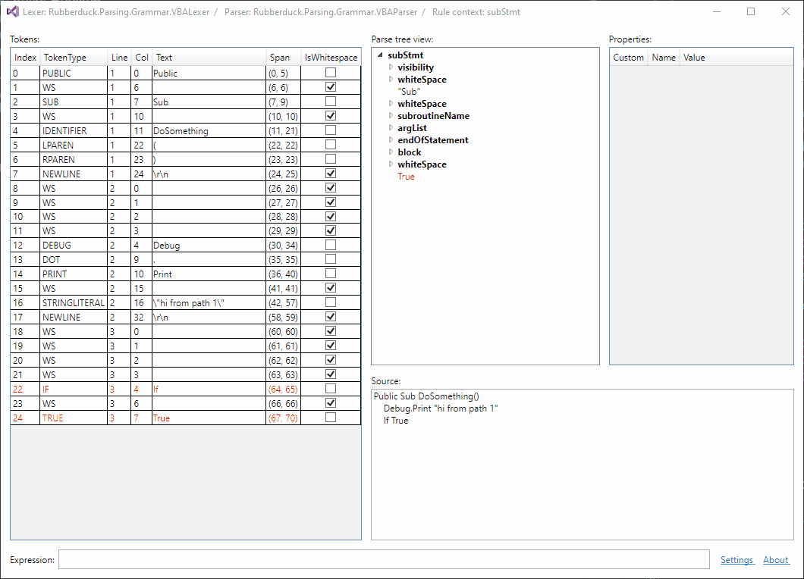
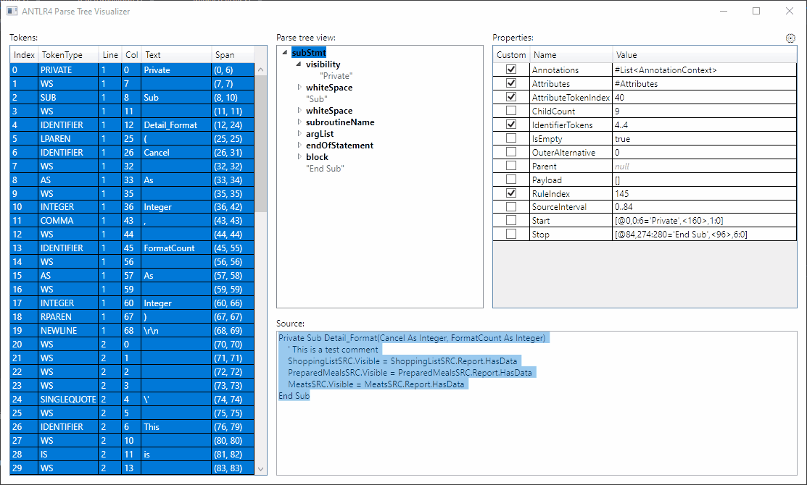
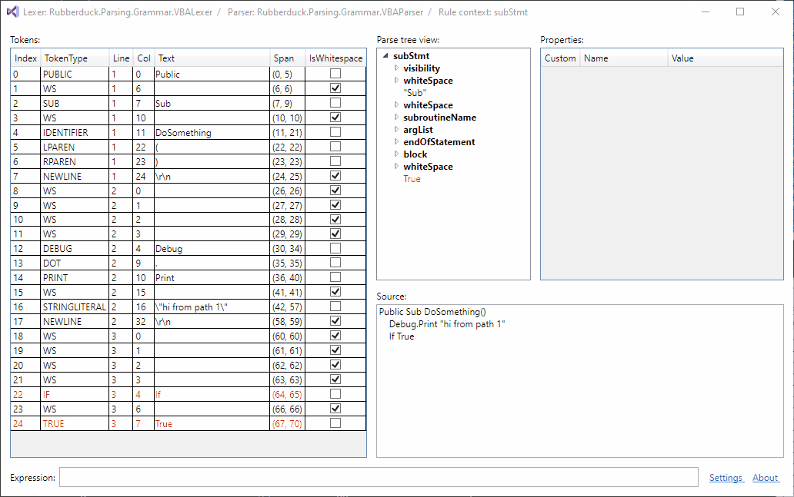
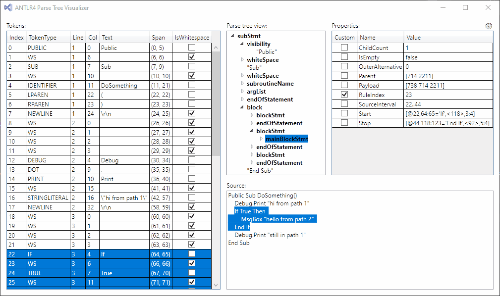
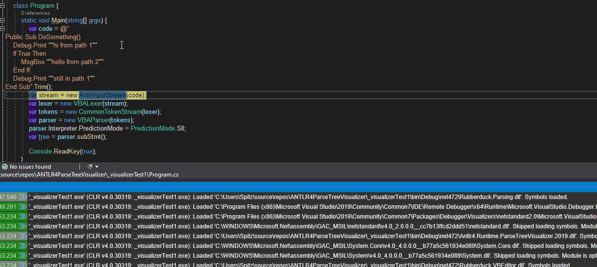

# ANTLR4 Parse Tree Visualizer

 

## Features

* List of tokens (error tokens are highlighted in red)
* Treeview of rule contexts and terminal nodes (error nodes in red)
* Properties of selected treeview node (properties not declared in the Antlr namespace are checked)
* Input text, or the text from the current channel positioned as in the input
* Selection sync, when selecting in the token list, the tree view, or the source text.

  

* Filtering the token list, by text, whitespace, or error; or by specific token types:

  

* Filtering the parse tree nodes by text, whitespace, or error nodes; or by specific rule types.

  

* Set a specific node as the root node, either in the current window, or in a new window

  

* You can also [embed the same UI in your own applications](https://github.com/zspitz/ANTLR4ParseTreeVisualizer/wiki/Embedding-UI-controls-in-third-party-apps).

## Requirements

* Tested with Visual Studio 2019 or 2017 (may work with older versions as well)  
* Supports the current Antlr.Runtime.Standard.DLL (4.7.2) as well as the older Antlr.Runtime.DLL (4.6.6).

## Installation

Before installing, you need to determine two things:

1. There are two .NET variants of the ANTLR4 runtime library: the "standard" version -- [Antlr4.Runtime.Standard](https://www.nuget.org/packages/Antlr4.Runtime.Standard/) -- and the "legacy" [Antlr4.Runtime](https://www.nuget.org/packages/Antlr4.Runtime/) at version 4.6.6. Which variant is your code using?
2. Are you using Visual Studio 2019 or 2017?

Then:

1. Go to the [releases](https://github.com/zspitz/ANTLR4ParseTreeVisualizer/releases) page. Choose the appropriate ZIP file(s) based on the Antlr4 variant and your version of Visual Studio.

   For example, if you're in Visual Studio 2019 and debugging code written against `Antlr4.Runtime.Standard`, download the `ParseTreeVisualizer.Standard.2019.zip` file.

   Note: if you need to, you can download and install all four visualizer variants; they won't overwrite each other.

2. You may need to [unblock the file](https://github.com/zspitz/ExpressionToString/wiki/Troubleshooting-visualizer-installation).
3. Unzip the contents of the ZIP file into one of Visual Studio's recognized visualizer folders:

    * _VisualStudioInstallPath_`\Common7\Packages\Debugger\Visualizers`
    * `My Documents\Visual Studio `_Version_`\Visualizers`

    You don't have to restart VS, just make sure VS is not currently in a debugging session

You can also compile the source yourself (`ANTLR4ParseTreeVisualizer.sln`) and place the output DLLs in one of the appropriate visualizer folders.

Note: For VS 2017, the DLLs will end up in either the `Visualizers` parent folder, or a single subfolder. For VS 2019, there are additional subfolders for debugging various target frameworks.

## Usage

1. Begin a debugging session, and break at some point.
2. Hover over an instance of one of the visualizer target types (`Antlr4.Runtime.RuleContext`, `Antlr4.Runtime.BufferedTokenStream`, or `string`), in the code editor, or the Watch or Locals window. This instance can be exposed by any variable, or any expression; the type of the expression doesn't matter.
3. Click on the magnifying glass to the right of the expression.
4. You may need to choose a lexer class if you are visualizing a `string` and there are multiple lexers in the debugged assemblies; and you haven't already done so.
5. You may need to choose a parser class and a parser method from the settings, if you are visualizing a `BufferedTokenStream` or a `string`, and the debugged assemblies have multiple parser classes. (These choices persist between sessions, so if you've already chosen, there's no need to do so again.)

  

> If you see an error message "Could not load this custom viewer", [try turning Managed Compatibility off](https://github.com/zspitz/ANTLR4ParseTreeVisualizer/issues/50) (**Tools** -> **Options...** -> **General** -> **Debugging**).

## Contributing

* Test the visualizer. (The significance of this kind of contribution cannot be overestimated.)
* Suggest ideas and enhancements ([issues](https://github.com/zspitz/ANTLR4ParseTreeVisualizer/issues/new))
* Notify about bugs ([issues](https://github.com/zspitz/ANTLR4ParseTreeVisualizer/issues/new))
* Provide screenshots which could be used to demonstrate different features of the visualizer (also via ([issues](https://github.com/zspitz/ANTLR4ParseTreeVisualizer/issues/new)))
* Star the project
* Spread the word
* Provide feedback to Microsoft about [these limitations to the visualizer API](https://github.com/zspitz/ExpressionToString/wiki/External-issues)

## Roadmap

* [Parsing errors in a separate pane](https://github.com/zspitz/ANTLR4ParseTreeVisualizer/issues/24)
* [Standalone viewer](https://github.com/zspitz/ANTLR4ParseTreeVisualizer/issues/19)
