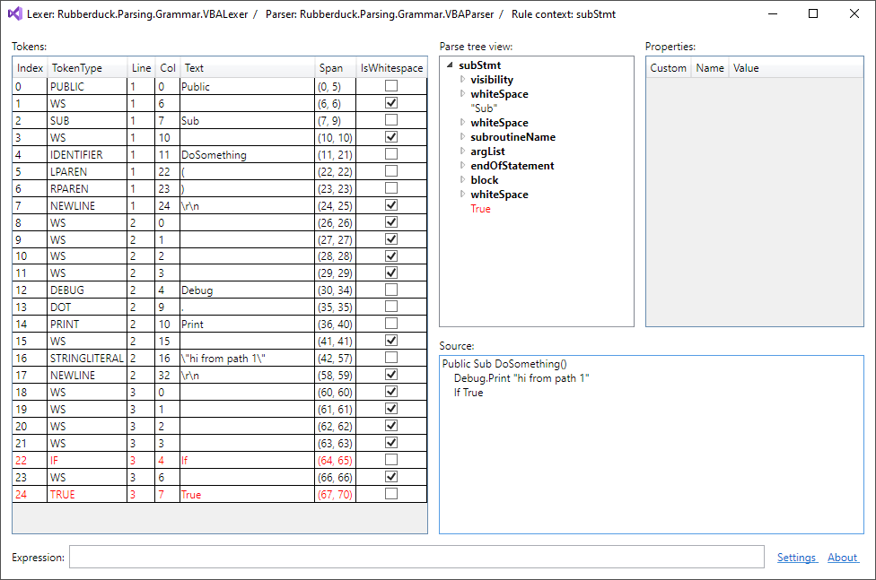
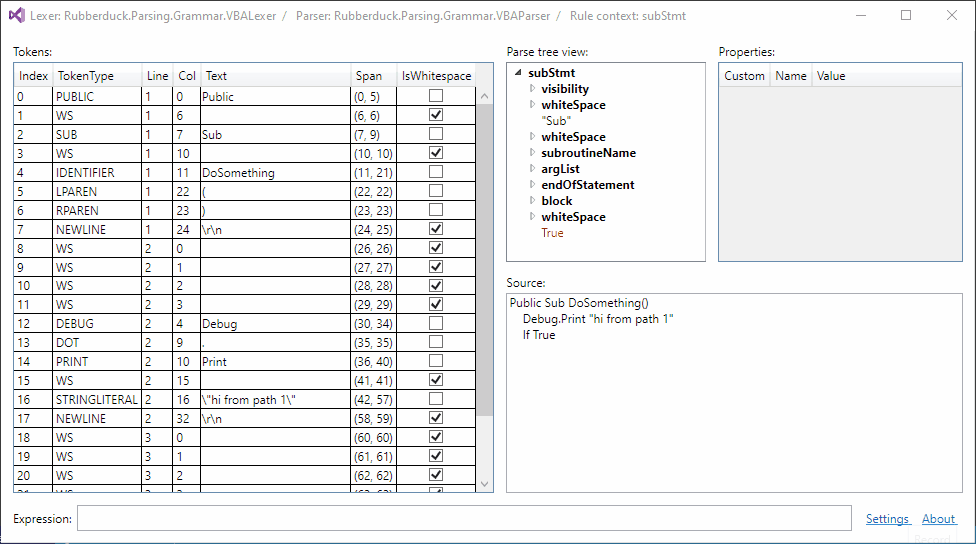

# ANTLR4 Parse Tree Visualizer

 

## Features

* List of tokens (error tokens are highlighted in red)
* Treeview of rule contexts and terminal nodes (error nodes in red)
* Properties of selected treeview node (properties not declared in the Antlr namespace are checked)
* Source view
* Selection sync, when selecting in the token list, the tree view, or the source text.

  

* Filtering the token list, by text, whitespace, or error; or by specific token types:

  

* Filtering the parse tree nodes by text, whitespace, or error nodes; or by specific rule types.

  

* Set a specific node as the root node, either in the current window, or in a new window

  

This project is very much in an alpha stage. It currently only targets `RuleContext` and derived classes.

## Requirements

* Visual Studio 2017 or 2019  
  (If you're using an older version of VS, you could probably use the visualizer as well. Compile against the appropriate version of Microsoft.VisualStudio.DebuggerVisualizers.dll.)
* Supports the current Antlr.Runtime.Standard.DLL (4.7.2) as well as the older Antlr.Runtime.DLL (4.6.6).

## Installation

1. Download the ZIP file matching your version of Visual Studio (2019 or 2017) from the [releases](https://github.com/zspitz/ANTLR4ParseTreeVisualizer/releases) page.
2. Unzip the contents of the ZIP file into one of Visual Studio's recognized visualizer folders. You don't have to restart VS, just make sure VS is not currently in a debugging session:

* _VisualStudioInstallPath_`\Common7\Packages\Debugger\Visualizers`
* `My Documents\Visual Studio `_Version_`\Visualizers`

You can also compile the source yourself and place the output DLLs in one of the visualizer folder.

If you are debugging .NET Core applications, you may also need to put an additional copy of the visualizer files in a subfolder called `netstandard2.0`, under the folder where installed the visualizer.

## Usage

1. Begin a debugging session, and break at some point.
2. Navigate to an instance of one of the visualizer target types (ATM only `RulerContext`, but can also be a subtype), in the code editor, or the Watch or Locals window. This instance can be exposed by any variable, or any expression; the type of the expression doesn't matter.
3. Click on the magnifying glass to the right of the expression.

## Contributing

* Test the visualizer. (The significance of this kind of contribution cannot be overestimated.)
* Suggest ideas and enhancements ([issues](https://github.com/zspitz/ANTLR4ParseTreeVisualizer/issues/new))
* Notify about bugs ([issues](https://github.com/zspitz/ANTLR4ParseTreeVisualizer/issues/new))
* Feel free to star the project
* Provide feedback to Microsoft about [these limitations to the visualizer API](https://github.com/zspitz/ExpressionToString/wiki/External-issues)

## Roadmap

* The current visualization targets `RulerContext`. Some sort of visualization for token streams, usable from the `RulerContext` visualization, and independently.
* [Parsing errors in a separate pane](https://github.com/zspitz/ANTLR4ParseTreeVisualizer/issues/24)
* Live window, perhaps as a VS extension. It should be possible to select a lexer class from a lexer assembly, a parser class from a parser assembly, and display the resultant token stream and parse tree.
